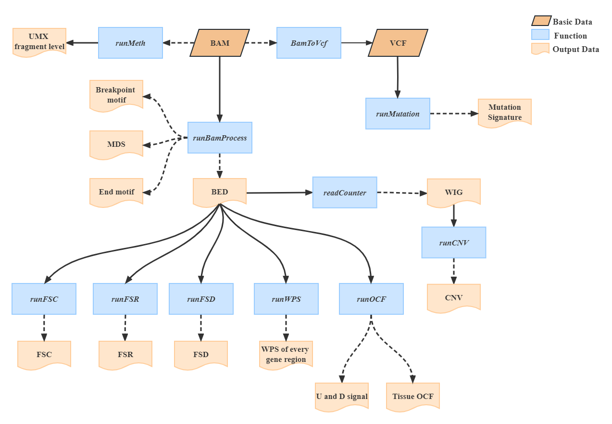

# cfDNAFE

* [Introduction](#introduction)
* [Section 1: Installation Tutorial](#section-1-installation-tutorial)
    * [Section 1.1: System requirement](#section-11-system-requirement)
    * [Section 1.2: Create environment and Install Dependencies](#section-12-create-environment-and-install-dependencies)
* [Section 2: Bam Data Processing (Function:runBamprocess)](#section-2-bam-data-processing)
* [Section 3: Fragment Size Ratrio (FSR) , Fragment Size Coverage (FSC) and Fragment Size Distribution (FSD) (Function: runFSR/runFSC/runFSD) ](#section-3-fragment-size-ratio-fsr-fragment-size-coverage-fsc--and-fragment-size-distribution-fsd)
* [Section 4: Windows protection score (WPS) (Function:runWPS) ](#section-4-windows-protection-score-wps)
* [Section 5: Orientation-aware cfDNA fragmentation (OCF) (Function:runOCF)](#section-5-orientation-aware-cfdna-fragmentation-ocf)
* [Section 6: Copy Number variations(CNV)(Function:runCNV) ](#section-6-copy-number-variations-cnv)
* [Section 7: Mutation Signature(Function:runMutation) ](#section-7-mutation-signature)
* [Section 8: UXM fragment-level (Function:runMeth) ](#section-8-uxm-fragment-level)


## Introduction

**cfDNAFE(<u>c</u>ell free DNA <u>F</u>eature <u>E</u>extraction)** is a tool for extracting cfDNA features, it contains **<font color=red>End Motif(EDM)</font>**,  **<font color=red>Breakpoint End(BPM)</font>**, **<font color=red>Motif-Diversity Score(MDS)</font>**, **<font color=red>Fragment Size Ratio (FSR)</font>**,**<font color=red>Fragment Size Distribution (FSD)</font>** ,**<font color=red> Windows protection score(WPS)</font>**,**<font color=red> Orientation-aware cfDNA fragmentation(OCF) value</font>**, **<font color=red>Copy Number variations(CNV)</font>**, **<font color=red>UXM fragment-level</font>** and **<font color=red>mutation signature</font>**.

The main functions are as the following picture.
<br/>
<center>
    
    <br>
    <div style="color:orange; border-bottom: 1px solid #d9d9d9;
    display: inline-block;
    color: #999;
    padding: 2px;">cfDNAFE Function</div>
</center>

<br/>


## Section 1: Installation Tutorial

### Section 1.1: System requirement
Since many whole genome sequencing(WGS) or whole genome bisulfite sequencing(WGBS) analysis toolkits are released on Unix/Linux systems, they are based on different programming languages. Therefore, it is very difficult to rewrite all software in one language. Fortunately, the [conda](https://docs.conda.io/en/latest/)/[bioconda](http://bioconda.github.io/)  program collects many popular python modules and bioinformatics software, so we can install all dependencies via  [conda](https://docs.conda.io/en/latest/)/[bioconda](http://bioconda.github.io/).

We recommend using [conda/Anaconda](https://www.anaconda.com/) and create a virtual environment to manage all the dependencies.

### Section 1.2: Create environment and Install Dependencies
First, run the following command. The environment will be created and all the dependencies as well as the latest cfDNAFE will be installed. 

```bash
#download cfDNAFE from github(From cfDNAFE you can get the files necessary for the software to run)
git clone https://github.com/Cuiwanxin1998/cfDNAFE.git
cd cfDNAFE/
#create a virtual environment and activate environment
conda env create -n cfDNAFE -f environment.yml
conda activate cfDNAFE
#install R function
Rscript ./scripts/install_Rpackages.R
#Add environment variables
export PATH=${PATH}:$PWD
```


## Section 2: Bam File Data Processing

cfDNAFE mainly processes bam file data. This function input is the initial step of cfDNAFE, which mainly extracts the bed input files required by the following functions and Motif End, Breakpoint End, MDS.

Human reference genome  can be obtained through [UCSC](https://genome.ucsc.edu/index.html), here we provide [GRCh37/hg19](https://hgdownload.soe.ucsc.edu/goldenPath/hg19/bigZips/) and [GRCh38/hg38](https://hgdownload.soe.ucsc.edu/goldenPath/hg38/bigZips/).


- Example Usage

```bash
cfDNAFE bam -p /path/to/bamfile -g /path/to/hg38.fa -o output_folders
```

- Output Folder Arrangement

```
output_folders/
├──sample1.bed
├──sample1.bed.gz
├──sample1.bed.gz.tbi
├──EDM
│   ├──sample1.EndMotif
├──BPM
│   ├──sample1.BreakPointMotif
├──MDS
│   ├──sample1.MDS
```

## Section 3: Fragment Size Ratio (FSR), Fragment Size Coverage (FSC) and Fragment Size Distribution (FSD)
**FSR**: The fragment sizes were used to construct fragmentation profiles with in-house scripts. The FSR was adapted from the [DELFI method](https://www.nature.com/articles/s41586-019-1272-6) and optimized by introducing an extra fragment size group and using improved cutoff. It was was generated using the short/intermediate/long fragments ratios except using different cutoffs: the short, intermediate and long fragments were defined as 65-150bp, 151-220bp and 221-400bp, according to the overall fragment lengths profile in our cohorts. 

**FSC**: FSC was generated using the coverages of short (65-150bp), intermediate (151-260bp), long (261-400bp), and total (65-400bp) cfDNA fragments. The extended ranges allowed the inclusion of broader size regions than what DELFI has reported. The genome was firstly divided into 100 kB bins. Next, the coverage of the four fragment size groups in each 100 kB bin was calculated and corrected by GC content. We then combined the coverages in every 50 contiguous 100 kB bins to calculate the coverage in the corresponding 5 MB (50 × 100 kB) bin. For each fragmentation size group, the scaled coverage score (z-score) in every 5 MB bin was calculated by comparing the variable value against the overall mean value.

**FSD**:The FSD examined fragment length patterns at a high resolution by grouping cfDNA fragments into length bins of 5bp ranging from 65bp and 400bp and calculating the ratio of fragments in each bin at arm level for each chromosome. A total of 41 chromosome arms were examined.

We provide 100kb window files for hg19 and hg38, you can find in **/cfDNAFE/data/ChormosomeBins/** and chromosome arms files for hg19 and hg38, you can find in **/cfDNAFE/data/ChormosomeArms/**.

- Example Usage

```bash
# run FSR
cfDNAFE fsr -p /path/to/bedgzfile -o output_folders/
# run FSC
cfDNAFE fsc -p /path/to/bedgzfile -o output_folders/
# run FSD
cfDNAFE fsd -p /path/to/bedgzfile -o output_folders/
```


- Output Folder Arrangement

```
output_folders/
├──sample1.FSR
├──sample1.FSC
├──sample1.FSD

```


## Section 4: Windows protection score (WPS)
**WPS**: Both outer alignment coordinates of PE data were extracted for properly paired reads. Both end coordinates of SR alignments were extracted when PE data were collapsed to SR data by adapter trimming. A fragment coverage is defined as all positions rag between the two (inferred) , inclusive of endpoints. We define the [windowed protection score (WPS)](https://www.cell.com/cell/fulltext/S0092-8674(15)01569-X?_returnURL=https%3A%2F%2Flinkinghub.elsevier.com%2Fretrieve%2Fpii%2FS009286741501569X%3Fshowall%3Dtrue) of a window of size k as the number of molecules spanning the window minus those with an endpoint within the window. 

We provide the downstream 1kb and 10kb of the TSS of each gene for hg19 and hg38 in **/cfDNAFE/data/transcriptAnno/**.

Moreover, we will illustrate how to get gene bodies from gencode annotation files. Users can download gencode annotation files from [gencode database](ftp://ftp.ebi.ac.uk/pub/databases/gencode/Gencode_human/), the commonly used files are [gencode.v19.annotation.gtf.gz](ftp://ftp.ebi.ac.uk/pub/databases/gencode/Gencode_human/release_19/gencode.v19.annotation.gtf.gz) for hg19 and [gencode.v37.annotation.gtf.gz](ftp://ftp.ebi.ac.uk/pub/databases/gencode/Gencode_human/release_37/gencode.v37.annotation.gtf.gz) for hg38. Here, we use transcriptAnno-hg38-1kb.tsv as deafult.

- Example Usage

```bash
cfDNAFE wps -p /path/to/bedgzfile -o output_folders/
```
 
- Output Folder Arrangement

```
output_folders/
├──sample1
│   ├──sample1_ENSG000000003.14.tsv.gz
│   ├──sample1_ENSG000000005.5tsv.gz
│   ├──sample1_ENSG0000000419.12.tsv.gz
│   │.....

```

## Section 5: Orientation-aware cfDNA fragmentation (OCF)
**OCF**: To explore the potential in inferring the relative contributions of various tissues in the plasma DNA pool, [Sun *et al.*](https://genome.cshlp.org/content/29/3/418.full) developed a novel approach to measure the differential phasing of upstream (U) and downstream (D) fragment ends in tissue-specific open chromatin regions. They called this strategy orientation-aware cfDNA fragmentation (OCF) analysis. OCF values are based on the differences in U and D end signals in the center of the relevant open chromatin regions. For tissues that contributed DNA into plasma, one would expect much cfDNA fragmentation to have occurred at the nucleosome-depleted region in the center of the corresponding tissue-specific open chromatin regions. In such a region, U and D ends exhibited the highest read densities (i.e., peaks) at ∼60 bp from the center, whereas the peaks for U and D ends were located on the right- and left-hand sides, respectively. Conversely, this pattern would not be expected for tissue-specific open chromatin regions where the corresponding tissue did not contribute DNA into the plasma. Thus measured the differences of U and D end signals in 20-bp windows around the peaks in the tissue-specific open chromatin regions as the OCF value for the corresponding tissue.

We provide tissue specific open chromatin regions for seven tissues, you can find in **/cfDNAFE/data/OpenChromatinRegion/**


- Example Usage

```bash
cfDNAFE ocf -p /path/to/bedgzfile -o output_folders/

```
 
- Output Folder Arrangement

```
output_folders/
├──sample1
│   ├──Breast.sync.end
│   ├──Intestine.sync.end
│   ├──Liver.sync.end
│   ├──Lung.sync.end
│   ├──Ovary.sync.end
│   ├──Placenta.sync.end
│   ├──Tcell.sync.end
│   ├──all.ocf.csv 

```


## Section 6: Copy Number variations (CNV)
**CNV**: The Copy Number Variation (CNV) profile was calculated using ichorCNA as reported by [Wan *et al.*](https://bmccancer.biomedcentral.com/articles/10.1186/s12885-019-6003-8). First, the genome of each sample was divided into 1 MB bins. For each bin, the depth after bin-level GC correction was used by a Hidden Markov Model (HMM) to compare against the software baseline. Then, we calculated the log2 ratio for the CNV score.

There are 2 main steps in this part, generating read count coverage information using readCounter from the HMMcopy suite.

- Example Usage 

```bash
cfDNAFE cnv -p /path/to/bamfile -o output_folders/
```

- Output Folder Arrangement

```
output_folders/ 
├──sample1.CNV

```

## Section 7: Mutation Signature
**Mutation signature**: Each mutational process is thought to leave its own characteristic mark on the genome. For example, AID/APOBEC activity can specifically cause C > T and C > G substitutions at TpCpA and TpCpT sites (of which the underlined nucleotide is mutated.  Thus, patterns of somatic mutations can serve as readout of the mutational processes that have been active and as proxies for the molecular perturbations in a tumour. These [mutational signatures](https://doi.org/10.1038/nature12477) are characterized by a specific contribution of 96 base substitution types with a certain sequence context.

- Example Usage  

```bash
cfDNAFE mutation -p /path/to/bamfile -o output_folders/
```
 

- Output Folder Arrangement

```
output_folders/
├──sample.signatures
├──sample.96.mutation.profle
```

## Section 8: UXM fragment-level
**UXM fragment-level**: Each fragment was annotated as U (mostly unmethylated), M (mostly methylated) or X (mixed) depending on the number of methylated and unmethylated CpGs64. We then calculated, for each genomic region (marker) and across all cell types, the proportion of [U/X/M](https://www.nature.com/articles/s41586-022-05580-6) fragments with at least k CpGs.

cfDNAFE provide a function **runMeth** to calculate the UXM fragment-level. We collect the top 25 differentially unmethylated regions for each cell type comprise a human cell-type-specific methylation atlas in **/cfDNAFE/data/MethMark/**. And cfDNAFE allows users to use custom disease-specific or tissue-specific marks, which requires that the mark contains the chromosome, the start position of the region, the end position of the region and file names ends with **.bed** file


- Example Usage  

```bash
cfDNAFE meth -p /path/to/bamfile -o output_folders/
```

 

- Output Folder Arrangement

```
output_folders/
├── sample1.UXM.tsv
├── sample2.UXM.tsv
```


## Authors
* **xq Peng**- [Central South University](https://life.csu.edu.cn/jsxx.jsp?urltype=news.NewsContentUrl&wbtreeid=1815&wbnewsid=3625)
* **wx Cui** -  [Central South University](https://cse.csu.edu.cn/)


## Version update

* **cfDNAFE v0.1.0** - * News version 0.1.0, 2023.04.01 The first version.* 